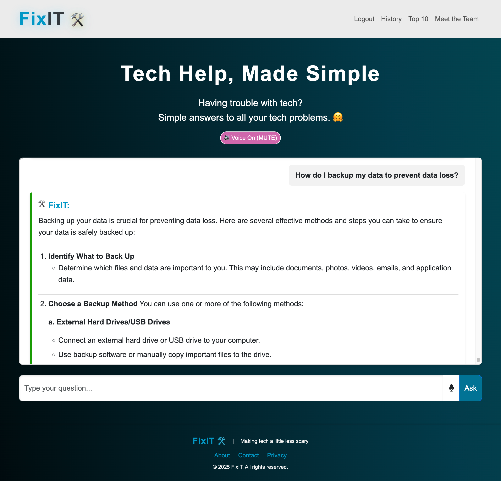

# 🛠️ FixIT - AI-Powered Tech Support for Families

🌐 **Live Site**: [FixIT](https://fixit-af0e14cb45cc.herokuapp.com/)

---

FixIT is an AI-powered platform designed to help families provide simple, accessible tech support—especially for older adults who may not be tech-savvy. The platform enables users to describe their technical issues and receive clear, step-by-step solutions powered by AI.

For detailed information on each aspect of the project, please refer to the individual files linked above.

---

## 👋 Introduction

Welcome to **FixIT - AI-Powered Tech Support for Families!**  
This platform is designed to help families provide simple, accessible tech support, especially for older adults who may not be tech-savvy. FixIT enables users to describe their technical issues and receive clear, step-by-step solutions powered by AI.

---

## 🎯 Purpose

Many older users struggle with basic tech problems and don’t always have immediate access to help. FixIT is built to bridge this gap by:

- Providing simple, understandable solutions for common tech problems  
- Offering a clean, user-friendly interface  
- Using AI to interpret user questions and return helpful, tailored advice  
- Potentially enabling remote assistance from family or support agents  

---

## 🧠 How It Works

1. **User Input:** A user types a problem (e.g., "My Wi-Fi isn't working").  
2. **AI Processing:** The input is analyzed using AI to detect intent and keywords.  
3. **Knowledge Base Lookup:** The platform matches the issue to known problems in the database.  
4. **Solution Display:** A friendly, easy-to-follow solution is displayed to the user.  

---

## 🗃️ Core Models

- **Problem**: Stores known tech issues and common keywords.  
- **Solution**: Contains step-by-step guidance linked to one or more problems.  
- *(Planned)* **Device**: Support for device-specific troubleshooting.  
- *(Planned)* **User Profiles**: To track past queries and customize responses.  

---

## 🔮 AI Integration

- **Current**: Using OpenAI's GPT-4o API for natural language understanding.

**Planned Features:**

- Intent recognition (e.g., “can’t connect to internet” vs “slow connection”)  
- Entity extraction (e.g., printer, email, Wi-Fi)  
- Personalized suggestions based on past issues or devices  

---

## 🧪 MVP Features

- [x] User form to submit tech issues  
- [x] AI-generated simple explanations  
- [x] Database of common problems and solutions  
- [x] Clean, responsive HTML templates  
- [ ] Device-specific guidance  
- [ ] Feedback on solution helpfulness  

---

## 🛣️ Roadmap

- [ ] Add user accounts  
- [ ] Expand the AI’s knowledge base  
- [ ] Add remote support request feature  
- [ ] Voice input (accessibility support)  
- [ ] Mobile-first UX improvements  

---

## 🧰 Tech Stack

- **Backend**: Django (Python)  
- **Frontend**: HTML5, CSS (Bootstrap or Tailwind CSS)  
- **AI**: OpenAI GPT-4o API  
- **Database**: PostgreSQL (via Neon.tech)  
- **Hosting**: TBD (likely Railway, Render, or Vercel)  

---

## 🧑‍🤝‍🧑 Team

- **[Nour](https://github.com/NourShbair): Scrum Master & Tech Lead**
- **[Noah](https://github.com/Noah-Samawi): Full-Stack Developer**
- **[Hugh](https://github.com/HughKeenan): Full-Stack Developer**
- **[Elena](https://github.com/Enzolita): Front-End Developer**
- **[Sylveria](https://github.com/ozi-cheri): Junior Developer**

---

## 🤝 Support & Contact

If you need help or clarification, feel free to contact:

- [**Nour**](https://www.linkedin.com/in/nourshbair/)
- [**Noah**](https://www.linkedin.com/in/noah-al-samawi-058583197/) 
- [**Hugh**](https://www.linkedin.com/in/hugh-keenan/) 
- [**Elena**](https://www.linkedin.com/in/elena-hanna-1b0a971b7/)
- [**Sylveria**](https://www.linkedin.com/in/sylveria-ozioma-ihemedu-3778aa2bb/)

## Acknowledgements

We extend our heartfelt gratitude to the following:

- **Code Institute** for organizing the "Code to Protect" hackathon.
- **FixIT Team** for their dedication and hard work.
